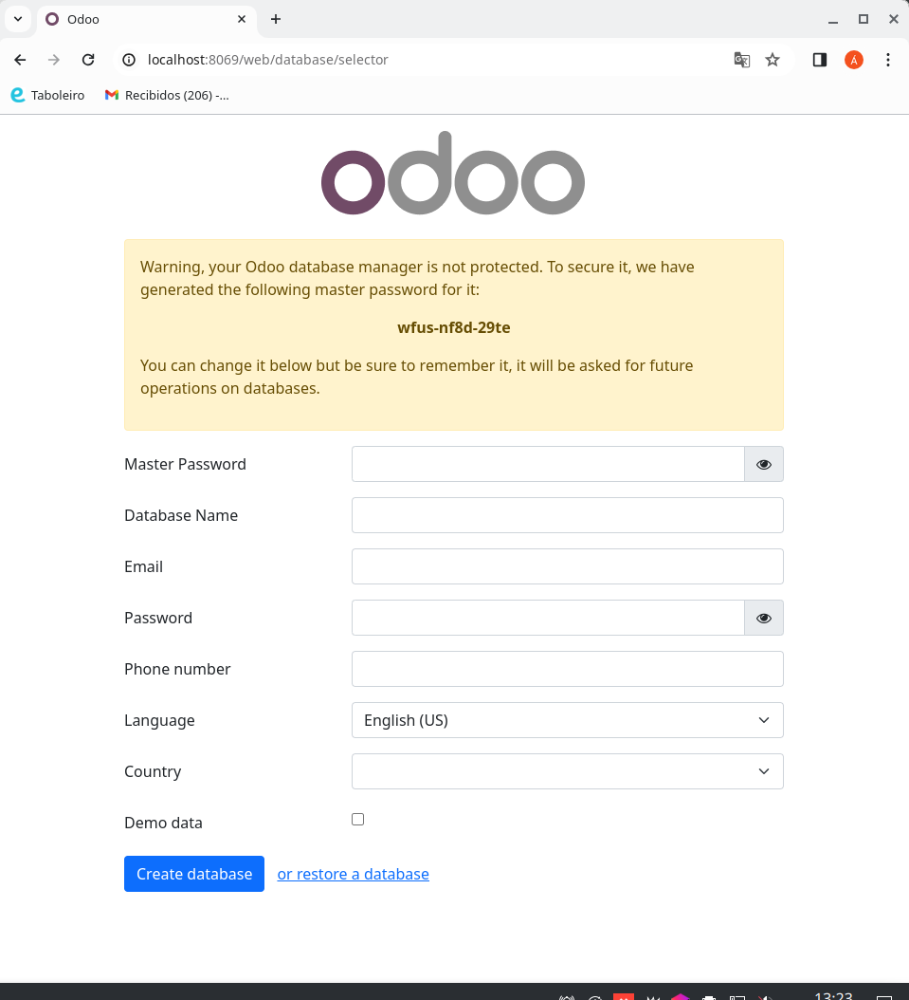
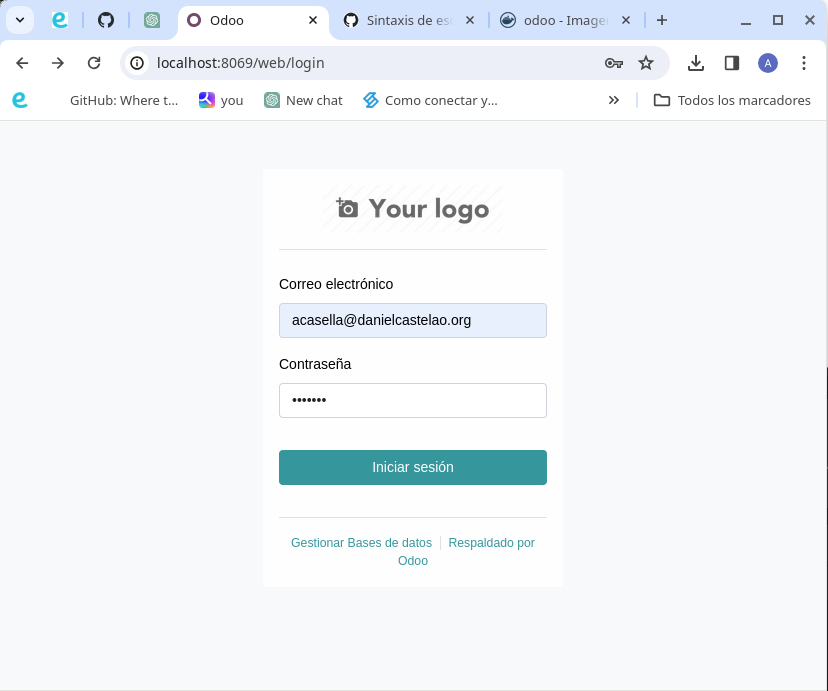
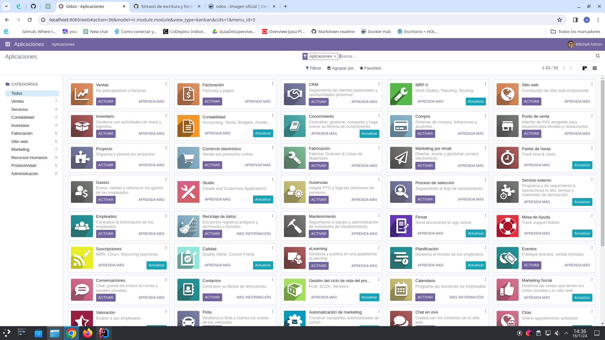

# Tarea: Odoo Instalación
## Enunciado:
- Configura Odoo con docker-compose.
  - Usar docker-compose.
  - Configura Postgresql y realizas pruebas.
  - Configura Odoo y enlazalo con el contenedor de Postgtresql.
  - Enlazar PyCharm con el docker y con la base de datos.
  - Entrega el repositorio con los ficheros y en el Readme la explicación.

En el readme tiene que estar explicado las diferentes partes del docker-composer, asi como comandos para lanzar los contenedores.

¿Que ocurre si en el ordenador local el puerto 5432 está ocupado? ¿Como lo puedes solucionar?

Se valora formato del Readme, capturas, commits, funcionalidad, capturas.

## Respuesta:
1. Busco en DockerHub el compose y uso el siguiente:
   ```
   version: '3.1'
   services:
      web:
         image: odoo:16.0
         depends_on:
           - db
         ports:
           - "8069:8069"
      db:
         image: postgres:15
         environment:
           - POSTGRES_DB=postgres
           - POSTGRES_PASSWORD=odoo
           - POSTGRES_USER=odoo
         ports:
           - "5432:5432"
   ```
`version: '3.1'`: Especifica la versión de la sintaxis de Docker Compose que se está utilizando. 
**En este caso, se utiliza la versión 3.1.**

`services`: Define los servicios que se ejecutarán. 
**En este caso, hay dos servicios: web (para Odoo) y db (para PostgreSQL).**

**Servicio Odoo (`web`)**:<br>
`image: odoo:16.0`: Especifica la imagen de Docker a utilizar para el servicio Odoo. 
**En este caso, se utiliza la imagen de Odoo versión 16.0.**

`depends_on:` **Indica que este servicio depende del servicio db.** 
Docker Compose **garantizará** que el servicio de la base de datos esté disponible **antes de iniciar** el servicio Odoo.

`ports:` Mapea los puertos entre el sistema host y los contenedores. 
**En este caso, el puerto 8069 del sistema host se mapea al puerto 8069 del contenedor Odoo.**

**Servicio PostgreSQL (`db`)**:<br>
`image: postgres:15`: Especifica la imagen de Docker a utilizar para el servicio de la base de datos PostgreSQL. 
**En este caso, se utiliza la imagen de PostgreSQL versión 15.**

`environment:` Establece variables de entorno para la base de datos. 
**Aquí se configura la base de datos con el nombre "postgres", el usuario "odoo", y la contraseña "odoo".**

`ports:` Mapea los puertos entre el sistema host y los contenedores. 
**En este caso, el puerto 5432 del sistema host se mapea al puerto 5432 del contenedor PostgreSQL.**

2. Una vez creado el [docker-compose.yml](docker-compose.yml) se debe lanzar con el comando:
`docker-compose up -d`


3. En el buscador web escribir: **http://localhost:8069** o el IP del equipo con el puerto 8069.


4. Se carga la siguiente ventana y se debe rellenar los datos solicitados:

> [!IMPORTANT]
> En el apartado **Database Name** se debe crear un nombre nuevo para la base de datos, 
> ya que el **postgres** que se refleja en el docker-compose se refiere a la base de datos
> que usa Odoo en su configuración prederteminada.


5. Una vez pulsado el botón Create database, se carga la siguiente ventana:


Y cuando se inicia sesión carla la siguiente ventana:

